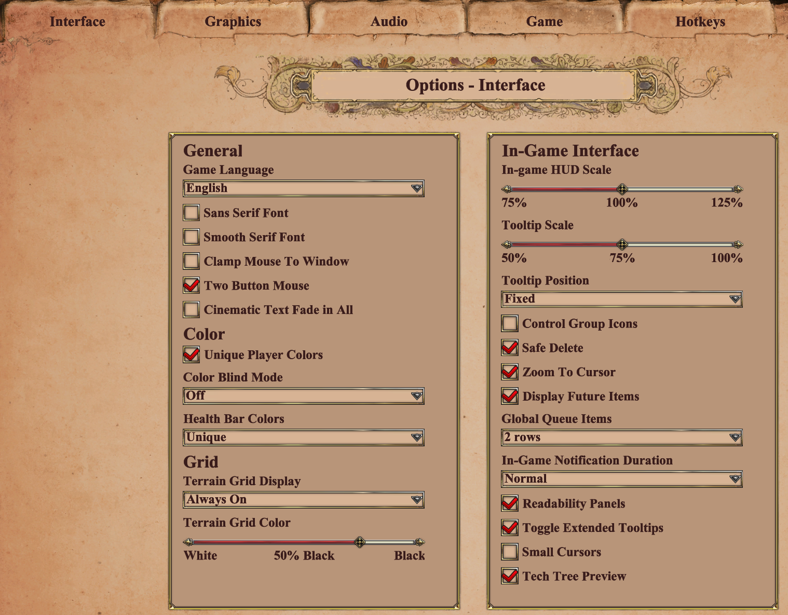
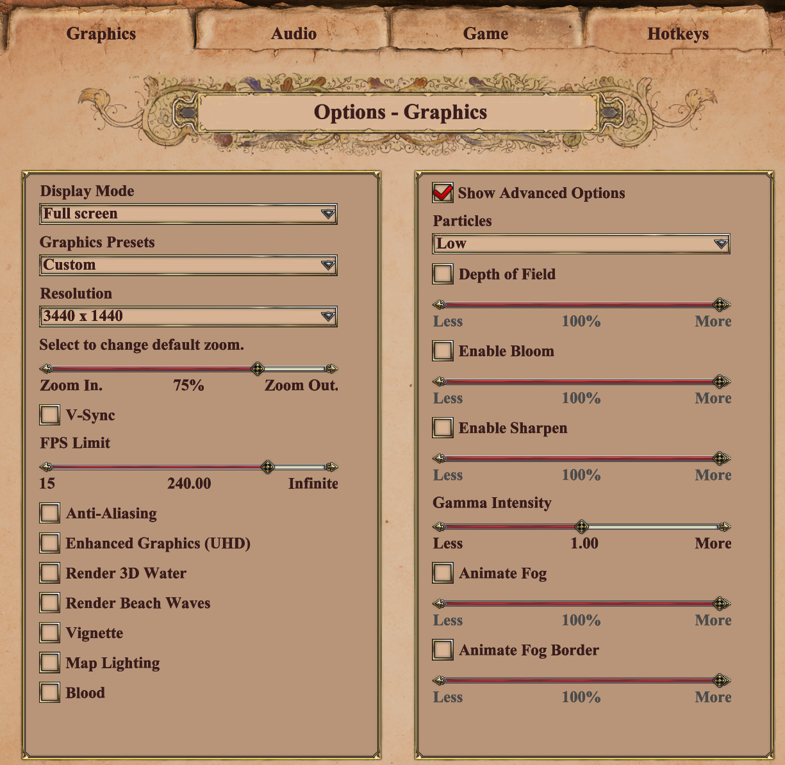
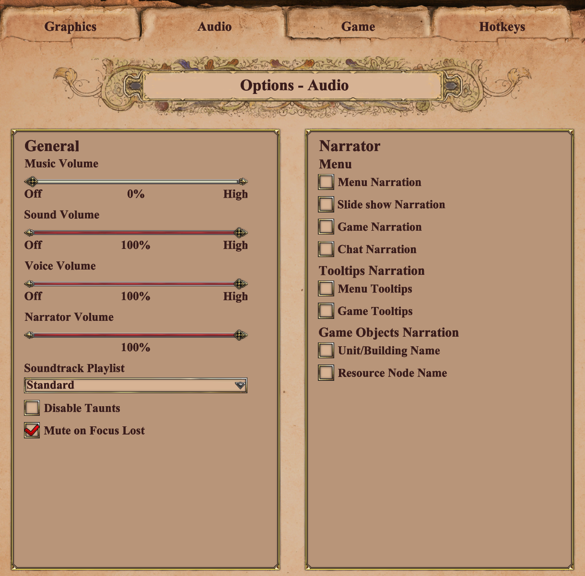
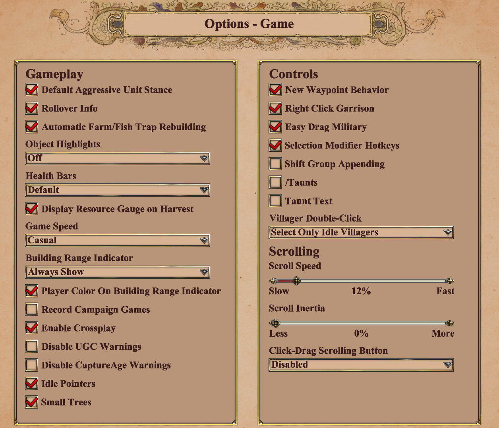

# THE ONE KEY WIN

Make the following changes to make this script functional

  
  
  
  
  
  
  
  
  
# HOTKEYS  
## Load the definative hot keys then change the following...  
  
### Page - Unit commands  
Economic Buildings -> F12  
Garrison -> UNBIND  
Military Buildings -> UNBIND  
Set Gather Boint -> Extrabutton2 
Ungarrison -> Extrabutton2 
Delete Unit -> MiddleButton
  
### Page - Game commands  
Select all town centers -> Extrabutton2  
  
### Page - Scroll commands  
UNBIND all in this section  
  
### Page - zoom commands  
Zoom in -> UP  
Zoom out -> Down  
  
### Page - Gate commands  
Rotate gate colockwise -> WheelUp  
Rotate gate counter-clockwise -> WheelDown  
  
### Page - Villager build  
Cancel -> F10  
Set all remaining buildings to whatever single lowercase alphabetical character key you want...  
...so long as its unique to that building whether its milatry or eco.  

### Page - Town Center  
Go Back To Work -> Extrabutton1  
Villager -> F11  

===

# How to use...
## Extrabutton2  
The idea is to spam mouse side button 1 (the easiest to reach at the front of the mouse, Extrbutton2) for villagers no matter the context.
The ui is a bit glitchy, but it selects all TCs if not selected already then proceeds to que vils on further button presses at a rate of one per press.  
  
ALSO it gives waypoint control every time the button is pressed, kinda meh feature    
  
ALSO if vills are docked in TC it will ungarisson them before you proceed to q further villagers per press (with right click as garison enabled)
  
## Extrabutton1  
The Extra button one works well with sending vils from TC back to work (with right click as garison enabled)  
it also can be used to cancel the way point being set on the Extrabutton2 spam end,  
when done spamming tap Extrabutton1 keeping current active way point unchanged.  

  #  
  #  
    
### Feudal age ((Poles/food-eco)) to fling food to open market for feudal age Saracen ally to buy.  
Poles intial food farm lay only 10% thought was higher  
  
Output of main2.py 3000 food bank var:    
  
The ideal food:gold is 100:58 for saracen elephant, so open market going rate for food is set by an initial sell of: 1389 food  
  
From poles food bank of 3000 you could recieve tribute of: 2100 food  
...OR...  
Effectively buy 2100 tribute of food for: 1225 gold instead... so why/when to buy...  
Food diff equation:::  
for 900 food lost in 3000 tribute its actually worth 525 its weight in gold to the castle age saracen elephant...   
  
This idea relies on minimising food waste, so for it to be effective the amount of food lost in tribute that needs to be bought back before castle age troop production needs to be greater then the 1389 food set market price for an elephant... This totals to a minimum sell of 2381 food for the battle elephant via the open market from the pole, for the saracen to buy at 1389 gold for this buy back to have any time value. 2v2 pretty tricky but add a few players and maybe possible to break bank this way.             
   
-> For now castle age 800 food cost can also come from any going rate < 100:58 in the open market too just cus...    
  
-> Note gold tiles are scarce and can run out for saracen in castle age pretty rapid.  
  
-> Troop production for elephants is slow  
  
### Potential build orders  
Poles dark age build order, total::(2 houses 2 folwark 1 lumbercamp x farms) 7/25 on wood 18/25 farms after hunt+sheep   gathered => loom + click up  
Poles feudal age build order, total::(200-cost stone walls 5 houses 3 folwork 2 lumbercamp 18+x farms)     
  
Saracen dark age build order, total::(3 houses 1 lumbercamp 1 minecamp on gold 1 barracks) x/25 on wood x/25 on gold after hunt+sheep gathered => click up  
Saracen feudal age build order, total::(5 houses market blacksmith 2 stables 2 minecamp on gold) if food < 100:58 buy => click up   
Saracen castle age: spam elephants  

For now castle age 800 food cost can also come from any going rate < 100:58 in the open market too just cus...    
  
Note gold tiles are scarce and can run out for saracen in castle age pretty rapid.

  
